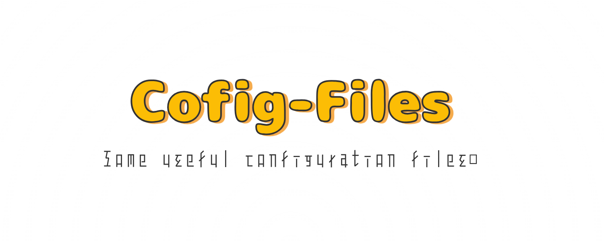

<!-- Title -->

  

  <h1>Config Files</h1>

  <h4>Some useful configuration files.</h4>

  

    
    
  

  

    <a href="#including">Including</a> •
    <a href="#license">License</a> •
    English •
    <a href="README_CN.md">中文</a>
  

<!-- Table of Contents -->

  
Table of Contents

  <ol>
    <li><a href="#including">Including</a></li>
    <li><a href="#update-time">Update Time</a></li>
    <li><a href="#license">License</a></li>
  </ol>

<!-- Including -->
## Including

- Clash for Windows
  - cfw-settings.yaml
  - Clash Core Service.xml
  - README.md
- Docker
  - docker-compose.yml
  - Dockerfile_SpringBoot
  - Dockerfile_Tomcat
- Git
  - .gitconfig
- JetBrains IDE
  - mobi.hsz.idea.gitignore
    - ForAndroidStudio.xml
    - ForIDEA.xml
  - OddyCodeStyle.xml
  - plugins-installed.txt
- Maven
  - settings.xml
- Prettier
  - .prettierrc
- Vim
  - .ideavimrc
- Windows Terminal
  - settings.json
- Zsh
  - .zshrc

(<a href="#readme-top">back to top</a>)

<!-- Update Time -->
## Update Time

See [UPDATE_TIME.md](UPDATE_TIME.md).

(<a href="#readme-top">back to top</a>)

<!-- License -->
## License

[MIT](LICENSE).

(<a href="#readme-top">back to top</a>)

